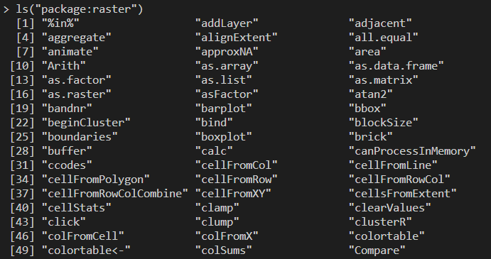
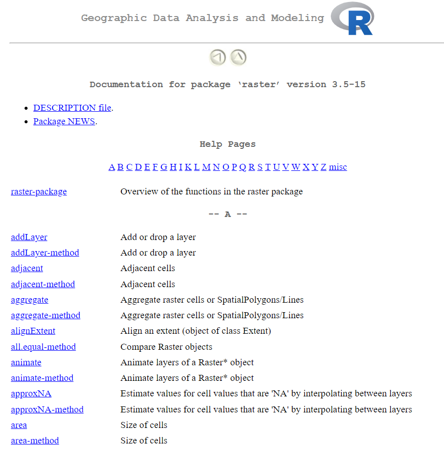

```{r setup, include=FALSE}
knitr::opts_chunk$set(echo = T, warning = F, message = F, eval = T)
```

## Instalación de Paquetes

Para la instalación de los paquetes en R se utiliza el comando `install.packages()` de la forma:

```{r eval=FALSE}
install.packages('nombre_del_paquete', dep=T)
```

Donde el argumento **dep=T** permite instalar todas las dependencias de este paquete. Los paquetes que se usaran en esta sesión son:

* sf
* terra
* rgdal
* raster
* ggplot2
* rasterVis
* tidyverse

Para hacer uso de las funciones que se encuentran dentro de los paquetes, primero es necesario cargar los paquetes, empleando el comando `library()` de la forma:

```{r eval=FALSE}
library(nombre_del_paquete)
```

un paquete recomendable que realiza los dos procesos anteriores es, el paquete **pacman**, el cual permite cargar el paquete, pero, en caso no estar instalado primero lo instala y luego lo carga. Se emplea de la siguiente forma:

```{r eval=FALSE}
library(pacman)
p_load(raster, rasterVis, terra, rgdal, tidyverse, sf, ggplot2)
```

Una forma resumida de emplear una función determinada de un paquete, sin la necesidad de cargar todo el paquete es, anteponer el nombre del paquete, seguido de dos puntos y el nombre de la función, de la forma:

```{r instalpkg}
pacman::p_load(raster, rasterVis, terra, rgdal, tidyverse, sf)
```

## Funciones dentro de los paquetes

Una forma práctica de explotar todas las funciones dentro de un determinado paquete es empleando la siguiente sintaxis:

```{r listarPaquetes, eval=F}
head(ls("package:raster"))
```

esto listará toas las funciones disponibles a la fecha en el paquete **raster**.



También se puede en ver una ulr local donde se puede ver el sistema de ayuda de cada función:

```{r listpkgWeb, eval=F}
help(package = raster)
```



A la fecha de hoy, el paquete raster dispone con 280 funciones.
